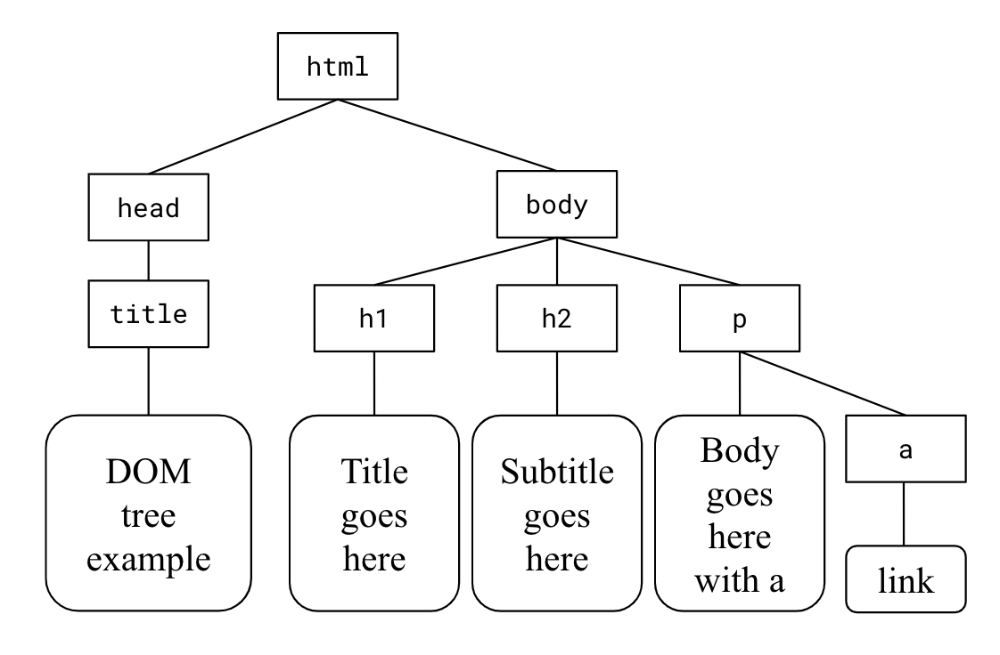

# Code Lab Session 4: Ready, set, loop — jQuery


## What is jQuery?

_jQuery is a fast, small, and feature-rich JavaScript library. It makes things like HTML document traversal and manipulation, event handling, animation, and Ajax much simpler with an easy-to-use API that works across a multitude of browsers. With a combination of versatility and extensibility, jQuery has changed the way that millions of people write JavaScript._ 
[jQuery.com](https://jquery.com).

jQuery is a JavaScript Library — a library of pre-written JavaScript which allows for easier development of JavaScript-based applications. jQuery is basically JavaScript, but it takes a lot of common tasks that require many lines of JavaScript code to process, and wraps them into methods that you can call with a single line of code.

## DOM

DOM stands for Document Object Model. It is a programming interface for HTML and XML documents. The DOM represents the document as nodes and objects. In this way, programming languages can connect to the page. When a web page is loaded, the browser builds up a model of the document’s structure and uses this model to draw the page on the screen.

You can think a HTML document as a nested stracture of html as a tree of objects. Here's an example document:

```
<!doctype html>
<html>
  <head>
    <title>DOM tree example</title>
  </head>
  <body>
    <h1>Title goes here</h1>
    <h2>Subtitle goes here</h2>
    <p>Body goes here with a <a>link</a></p>
  </body>
</html>
```

This page has the following structure:



Like this, the HTML DOM model is constructed as a tree of Objects. This object model is used by browsers to specify the logical structure of web pages, and based on this structure to render HTML elements on the screen. 


### How to implement jQuery

[Download jQuery](https://jquery.com/download)

To implement jQuery in your project, download the “compressed, production jQuery” package of the latest version. Locate the jQuery script you download into your project’s javascripts folder, and link to it before including your other JavaScript files:

```
<!DOCTYPE html>
<html>
<head>
  <title>How to implment jQuery</title>
  <script src="/common/jquery-3.4.1.min.js"></script>
  <script src="/common/yourscript.js"></script>
</head>
<body>
</body>
</html>
```

If you don't want to download and host jQuery yourself, you can include it from a CDN (stands for Content Delivery Network). It means a system of computers that exist all over the world and cache files for users to access. CDNs can greatly reduce the load time of a page by offering files at a higher bandwidth from a server that is physically closer to your visitor than your web server might be. The jQuery library will already be cached in the visitor's browser if they visited another website that references the same jQuery library. In this case, the visitor won't even have to download the jQuery library.


### How to use jQuery

When you write JavaScript using jQuery, you should always wrap the JavaScript in a special jQuery function that waits to run the code until the rest of the document (DOM) has finished loading.

```
$(function() {
  // Your JavaScript goes here.
});
```

The jQuery basic syntax is `$(selector).action()`:

- `$` sign define jQuery.
- A `(selector)` defines “query (or find)” HTML elements
- A `action()` to be performed on the element's.


### What is JSON?

In last session, we have seen an array with values that consists of name value pairs and methods: `var color = {r: “red”, g: “green”, b: “blue” }`.
It is very similar in syntax to another data structure in Javascript called JSON. JSON stands for JavaScript Object Notation, it is widely used for storing, serializing, and transmitting structured data. 

There are a few options to include JSON data in your project. As a stand alone file that can be loaded into your project or it can be formatted data coming from an online API. A JSON file is a string, it will like the following:

```
var color = '{"r": "red", "g": "green", "b":"blue"}'
```

JSON data is usaually loaded as an external file or request it from an API. A JSON file will look like following, with the quotations around the brackets.

```
{
"r": "red",
"g": "green",
"b": "blue"
}
```

All property names have to be surrounded by double quotes, and only simple data expressions are allowed—no function calls, bindings, or anything that involves actual computation. Comments are not allowed in JSON.


### How to implement JSON

To load JSON data using jQuery, use the getJSON() and ajax() method. The jQuery.getJSON( ) method loads JSON data from the server using a GET HTTP request.

```
<!DOCTYPE html>
<html>
<head>
  <title>How to implment jQuery</title>
  <script src="/common/jquery-3.4.1.min.js"></script>
  <script>
         $(document).ready(function() {
            $("button").click(function(event){
               $.getJSON('yourjson.json', function(mycolor) {
                  $('#color').html('<p>Red:' + mycolor.r+ '</p>');
                  $('#color').append('<p>Green:' + mycolor.g+ '</p>');
                  $('#color').append('<p>Blue:' + mycolor.b+ '</p>');
               });
            });
               
         });
      </script>
</head>
<body>
      <div id="color">
         Color
      </div>
      <button></button>
</body>
</html>
```

### Examples

Download the demos!