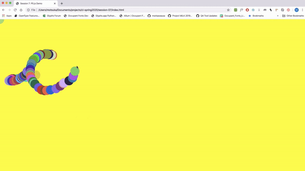

# Drawing with p5.js

🎥 **We recorded a walkthrough of this README on April 15, 2020.** Find that video [here](https://drive.google.com/file/d/1eSo_13KC1S-TS-9Xqc2aQ69QYbsvkC35/view?usp=sharing).



P5 sktech result made by Marie from the session on April 15, 2020

## What is p5.js?

[https://p5js.org/](https://p5js.org/)

P5.js is a JavaScript library based on Processing. Processing is an open-source graphical library that is developed to make it easy as possible for beginners to learn how to program interactive, graphical applications.


## Get Started
There are a few ways to write p5.js sketches. As p5.js is just another Javascript library, you can always include p5.js file like how you use other JS files. You can download a single file, or a complate library [here](https://p5js.org/download/) based on your needs.
You can also begin using p5.js directly on the browser by using [editor.p5js.org](https://editor.p5js.org/), it is a a web-based programming platform specifically built for p5.js. 


## Setup
The basic setup to create p5.js sketch is calling function `setup()` and `draw()`.

```
function setup() {
}

function draw() {
}
```

- The `setup()` function only runs when the program starts, it can not be callsed again after initial execution. You will put initial environment properties such as canvas size and load the media files(images, fonts, ...). The program contains only one `setup()`function. 
- The `draw()` function is called after `setup()` function. You will use `draw()` function to execute the code inside the canvas. It runs as a loop — the code inside the `draw()` function runs continuously from top to bottom until the program is stopped. The `draw()` loop may be stopped by calling `noLoop()`, and can then be resumed with `loop()`. If using `noLoop()` in `setup()`, it should be the last line inside the block. 


## Drawing

```
function setup() {
    createCanvas(500, 500); 
   } 
   
function draw() {
    background(0);
    fill(255);    
    circle(250, 250, 200);
}
```

### Shapes
- You can create [simple shapes](https://p5js.org/examples/hello-p5-simple-shapes.html) such as circle, square, triangle, and a flower. 
- For custom shapes, you will need to define a series of points by using `vertex()`, that are connected via lines to form the outline of a shape.

### Color
With RGB numbering system, you can adjust color and opacity: [p5.js: color](https://p5js.org/learn/color.html)


### Coordinates
P5.js takes pixel as a basic unit. The pixel in the top left corner of the browser is designated as the pixel at coortinate `0,0`. From there, x and y coorinate increases as you move further right and down.  

For more information 👉 [Processing: Coordinate System and Shapes](https://processing.org/tutorials/drawing/) 

### Function Calls 
Like this, p5.js comes with built-in **functions** that perform various tasks. Functions comes with a pair of parentheses; inside these parentheses are a list of values, seperated by commma. The function call ends with the semicolon `;`. You need to put a semicolon at the end of every function call.

These values defines the function’s parameters, and each function use its parameters in a slightly different way. Learning how to program in p5.js is mostly about learning what each functions does, and what its parameters mean. You can check more functions here 👉[p5.js](https://p5js.org/reference/)


## Variables

Variables are used for storing values. With variables, we can create interesting effect like motion, interactions, etc, by using this loop — we can vary what happens each time it is looping (every time `draw` excutes).

In this example, I changed the values of variables to affect the composition. 

```
function setup(){
    createCanvas(windowWidth, windowHeight);
}

function windowResized() {
    resizeCanvas(windowWidth, windowHeight);
}

function draw(){
    var diameter = min(width, height) * 0.5;

    background(0);
    fill(255);  

    circle(mouseX, mouseY, diameter);    
}
```


## Conditoinal
You can have more controls of your motion flow by using a `if-else` statement. The `if` statement executes a statement if a specified condition is truthy. When the condition is falsy, another statement can be executed.

More resources 👇
- [Mozilla: if...else](https://developer.mozilla.org/en-US/docs/Web/JavaScript/Reference/Statements/if...else) 
- [CodeLab Session3: Ready, set, loop](https://drive.google.com/open?id=1Sj5Cb_e4d3axEdMtFBGxQj-OiRFIZie4Om1kbvo5fjk)

```
var x = 0;
var speed = 10;

function setup(){
	createCanvas(windowWidth, windowHeight);
}

function windowResized() {
	resizeCanvas(windowWidth, windowHeight);
}

function draw(){
	var y = height / 2;
	var diameter = min(width, height) * 0.5;
	
	background(0);
	fill(255);  
	circle(x, y, diameter);

	if (x > width) {
		speed = -10;
	} else if ( x < 0 ) {
		speed = 10;
	}
	
	x = x + speed;
}
```

## Loop

If you want to have multiple items and play with them, rather than having an individual line of codes that same thing over and over agian, we can use another control structure `loop`. 

```
function setup(){
    createCanvas(windowWidth, windowHeight);
    background(0); 
}

function windowResized() {
    resizeCanvas(windowWidth, windowHeight);
}

function draw(){
    var x = 0;
    var y = height / 2;

    while (x <=windowWidth) {
        fill(255); 
        circle(x, y - 100, 10);
        x = x + 50;
    }

    for (var x = 0; x <= windowWidth; x = x + 50){
        fill(255); 
        circle(x, y + 100 , 10);
    }
}
```

## DOM Elements

Add button, slider, or any html elements as an interaction trigger!

- More information about DOM 👉 [Code Lab Session 4: Ready, set, loop — jQuery](https://github.com/RISD-Code-Lab/cl-spring2020/tree/master/session-04)
- More p5.js DOM elements 👉 [p5.js Element](https://p5js.org/reference/#/p5.Element)

```
var slider; 
var button;
function setup(){
    createCanvas(windowWidth/2, windowHeight/2);
    slider = createSlider(1,500, 250);
    bgcolor = color(0);
    button = createButton('click');
    button.mousePressed(changeColor);
}

function windowResized() {
    resizeCanvas(windowWidth/2, windowHeight/2);
}


function changeColor() {
    bgcolor = color(random(255));
}

function draw(){
    var x = width / 2;
    var y = height / 2;

    background(bgcolor);    
    fill(255);  

    circle(x, y, slider.value());
}
```

Finally, we are sharing M
## Other Resources
- [Code! Programming with p5.js](https://www.youtube.com/playlist?list=PLRqwX-V7Uu6Zy51Q-x9tMWIv9cueOFTFA)


